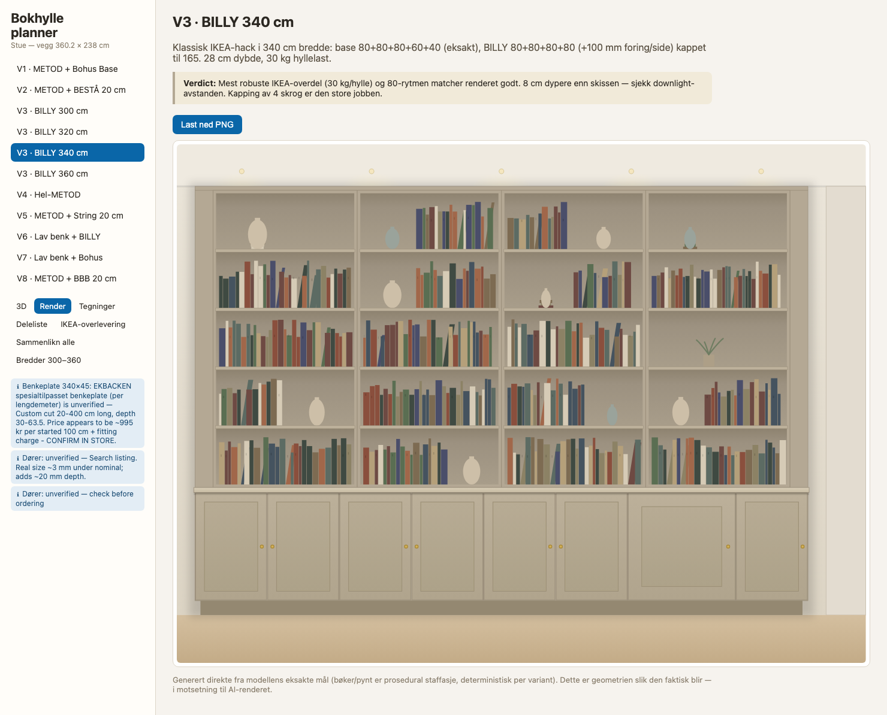

# bookcase-planner

Parametrisk «lekeplass» for den plassbygde bokhyllen i stua: én datamodell per
variant driver 3D-visning, målsatte front-/sidetegninger (SVG → PDF),
handleliste med artikkelnumre og kappliste. Bygget fordi IKEAs to planleggere
ikke kan sammenlikne METOD + BILLY/BESTÅ + ikke-IKEA-deler på ett sted.



Views per variant: 3D, presentasjonsrender (prosedural, deterministisk, PNG-eksport),
målsatte tegninger, deleliste, IKEA-overlevering — pluss breddeutforsker 300–360 cm
og variantsammenlikning. Innfesting er dokumentert mot virkelige bygg i
[docs/fastening.md](docs/fastening.md).

## Veggen

- Fri vegg **3602 mm** (venstre hjørne → sjakt 220 mm), **2380 mm** til underkant nedhakk.
- Målbredde møbel **3400 mm**, underskap ~708 mm høyt (METOD veggskap på ben), åpne hyller opp til nedhakket.
- Referansebilde (AI-render av ønsket resultat): `docs/reference.png`, håndskisse: `docs/sketch.png`.

## De fem variantene

Se `docs/variants.md` for full sammenlikning med tall, eller «Sammenlikn alle» i appen.

| | Overdel | Dybde | Kjøpte deler |
|---|---|---|---|
| V1 | 4× Bohus Base kappet til 165 | 267 | ~17 300 kr |
| V2 | BESTÅ 60×20 stablet 64+64+38 | 200 | ~17 600 kr |
| V3 | 4× BILLY 80 kappet til 165 | 280 | ~14 000 kr |
| V4 | Åpne METOD veggskap 2×80 høyt | 366 | ~14 700 kr |
| V5 | String-system vegghengt | 200 | ~26 800 kr |
| V6 | **Lav benk (50.8)** + BILLY kappet til 185 | 280 | ~12 500 kr |
| V7 | **Lav benk (50.8)** + Bohus kappet til 185 | 267 | ~15 800 kr |
| V8 | BBB System heltre (bokhyller.no) — 20 cm, null kapping | **200** | ~18 500 kr |

V3 finnes i fire bredder (300/320/340/360) — 320 og 360 treffer modulmålene eksakt.

Alle deler basen: METOD veggskap 3×80+60+40 på 8 cm ben (det finnes **ikke**
60 cm høye METOD *benkeskap* — veggskap på ben er trikset), STENSUND-dører,
spesialtilpasset benkeplate.

## Kjøring

```bash
npm install
npm run dev        # app på localhost:5173
npm test           # modellmatte (vitest)
npm run e2e        # Playwright: alle views + screenshots til docs/screenshots/
npm run import-bmproj  # hent kjøkkendesignet fra IKEA-planleggeren på nytt
```

## Struktur

- `catalogue/*.json` — håndverifiserte deler (IKEA NO + Bohus/String/Lundia/Tylko/JYSK) med kilde-URL og dato per rad. Appen kaller **aldri** IKEA i runtime.
- `src/designs/` — de fem variantene som typet data; `common.ts` har veggen og METOD-basen.
- `src/model/` — validering (bredder vs vegg, høyder vs nedhakk, katalogmål vs tegnet mål) og pris/kappliste.
- `src/views/` — three.js-3D, SVG-tegninger, delelister, sammenlikning, IKEA-overlevering.
- `scripts/import-bmproj.ts` — engangsimport av lagret IKEA-kjøkkendesign (offentlig JSON) → `designs/kitchen-seed.json`.
- `docs/` — referansebilder, screenshots fra e2e, byggeunderlag.

## Hvorfor ikke IKEAs planleggere / åpen kildekode?

Undersøkt 2026-10-03 (se `docs/research-notes.md`): kjøkkenplanleggeren er
Dassault HomeByMe i iframe med proprietære 3D-formater og innloggings-API —
vilkårene forbyr gjenbruk, og lagrede design kan bare *leses* (offentlig JSON,
derav importscriptet). BESTÅ-planleggeren er Babylon.js mot dexf-API — grei å
slå opp i, ubrukelig som fundament. Sweet Home 3D/react-planner/FreeCAD passet
dårlig for konfig-drevet møbeldesign med målsatte tegninger. ~10 parametriske
bokser er trivielt å eie selv.
