# De fem variantene — sammenlikning

Generert fra plannerens datamodell 2026-10-03. Tall = kjøpte deler inkl. felles
METOD-base (~9 700 kr, hvorav dører ~2 560 kr og benkeplate ~3 980 kr har
uverifisert pris). MDF, maling og montering kommer i tillegg — den posten er
størst der det er mest kapping/innkledning.

**Felles base i alle variantene:** METOD veggskap 3×80+60+40 = 340 cm på 8 cm
ben (det finnes ikke 60 cm høye METOD benkeskap — veggskap på ben er trikset),
STENSUND-dører, spesialtilpasset benkeplate ~340×45 cm. Overkant benk 708 mm.

| | V1 Bohus | V2 BESTÅ | V3 BILLY | V4 Hel-METOD | V5 String |
|---|---|---|---|---|---|
| Kjøpte deler | 17 267 kr | 17 596 kr | 13 971 kr | 14 701 kr | 26 761 kr |
| Hylledybde oppe | 267 mm | **200 mm = skisse** | 280 mm | 366 mm | **200 mm = skisse** |
| Skrog som må kappes | 4 | 0 | 4 | 0 | 0 |
| Butikker | IKEA + Bohus | IKEA | IKEA | IKEA | IKEA + Royal Design |
| Klaring til nedhakk | 22 mm | **12 mm (!)** | 22 mm | 72 mm | 100 mm |

## V1 · METOD + Bohus Base — *mest plassbygd-look per krone*

4× Bohus Base bokhylle (79 cm, 1 899 kr/stk) kappes til 165 cm og kles helt inn
i MDF. Karmen forsvinner bak malt ramme. **Men:** originalhyllene tåler bare
13 kg — byttes/stives av med 18 mm MDF. Med 4 skrog å kappe + full innkledning
er dette nær snekkerbygd i arbeidsmengde — **be montørene prise ren MDF-hylle
som sammenlikning.**

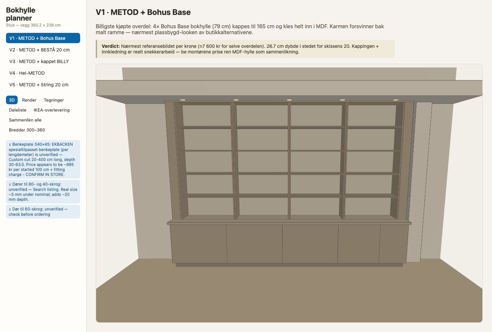
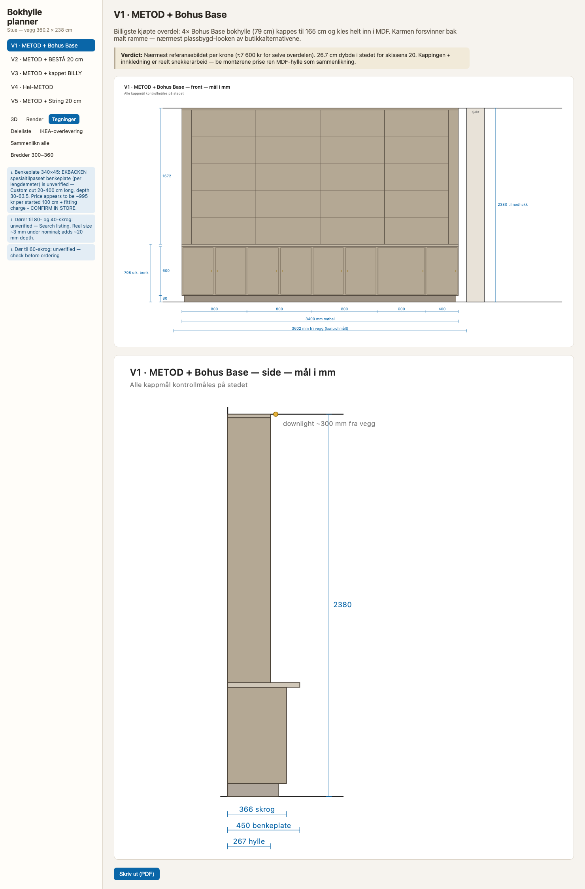

## V2 · METOD + BESTÅ — *eneste IKEA-vei til ekte 20 cm dybde*

BESTÅ 60×20-rammer stablet 64+64+38 oppå benken. Null kapping. **Men:** bredden
låses til 300 cm (5×60) → 20 cm foring i hver ende, 15 veggskinner, og bare
**12 mm klaring** til nedhakket — kontrollmål før bestilling!

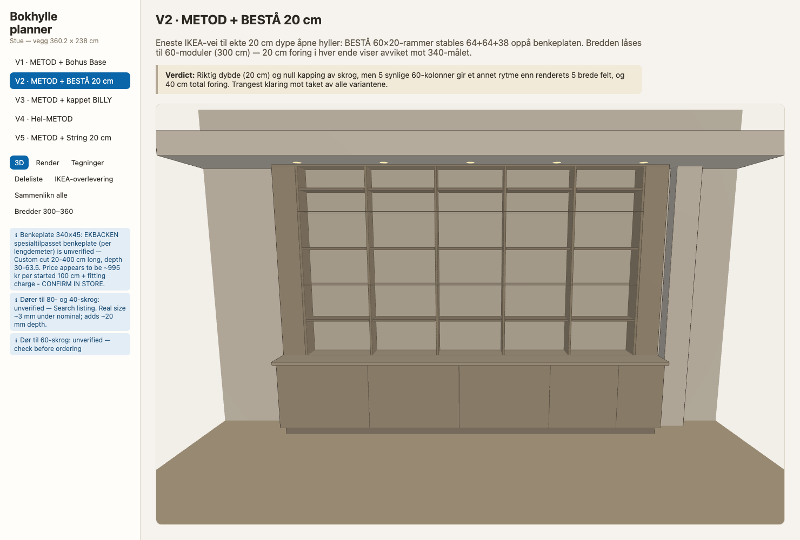
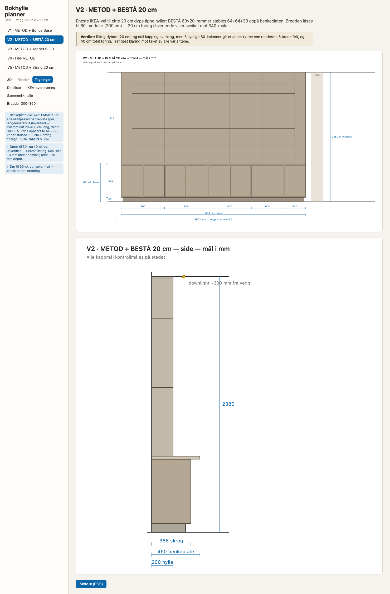

## V3 · METOD + kappet BILLY — *billigst, mest robust*

4× BILLY 80×28×202 (895 kr/stk) kappes til 165 cm. 30 kg hyllelast, 80-rytme
som matcher referansebildet. 28 cm dybde mot skissens 20 — sjekk mot
downlights (~30 cm fra vegg).

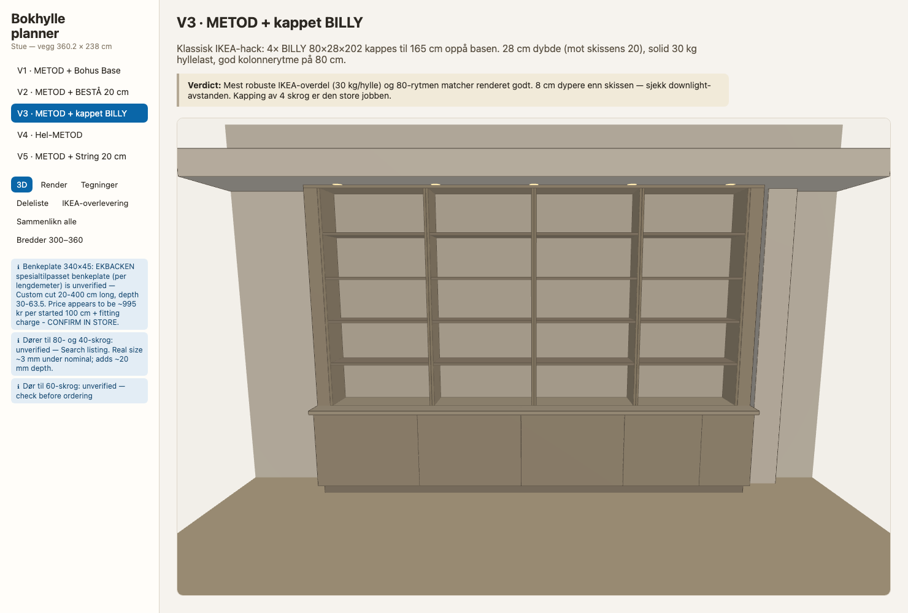
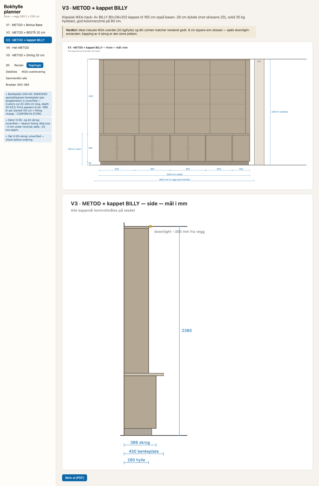

## V4 · Hel-METOD — *enklest logistikk*

Åpne METOD veggskap (4×80+20 = 340 eksakt) stablet 2×80 cm høyt. Én leverandør,
null kapping. **Men:** 36.6 cm dype åpne hyller ser tunge ut, gavlene flukter
ikke med basens deling (krever fasaderamme), og forkanten kolliderer nesten med
downlights. 20-stammen er uverifisert.

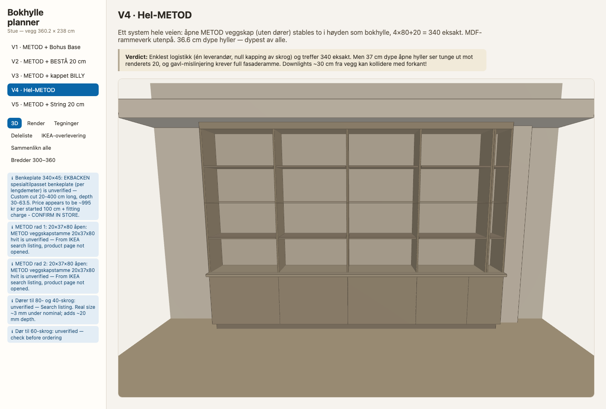
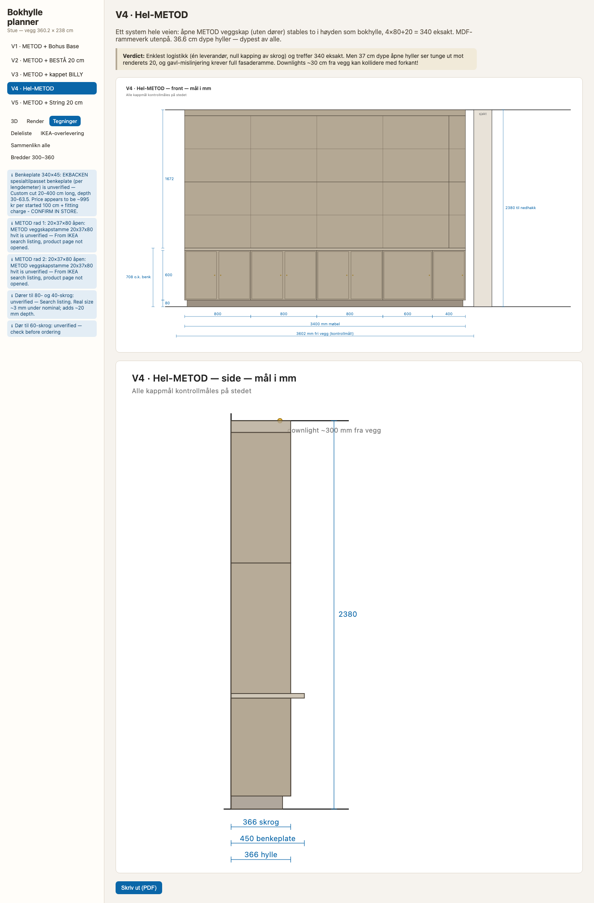

## V5 · METOD + String — *designklassikeren, ærlig talt noe annet*

String-system (eneste verifiserte ekte 20 cm-dybde i butikk) vegghengt over
basen, 2×78 + 3×58-felt. Null kapping. **Men:** stålgavlene males ikke — dette
LESES som String-hylle, ikke plassbygd bokhylle, og det er dyrest (~17 000 kr
bare for String-delene).

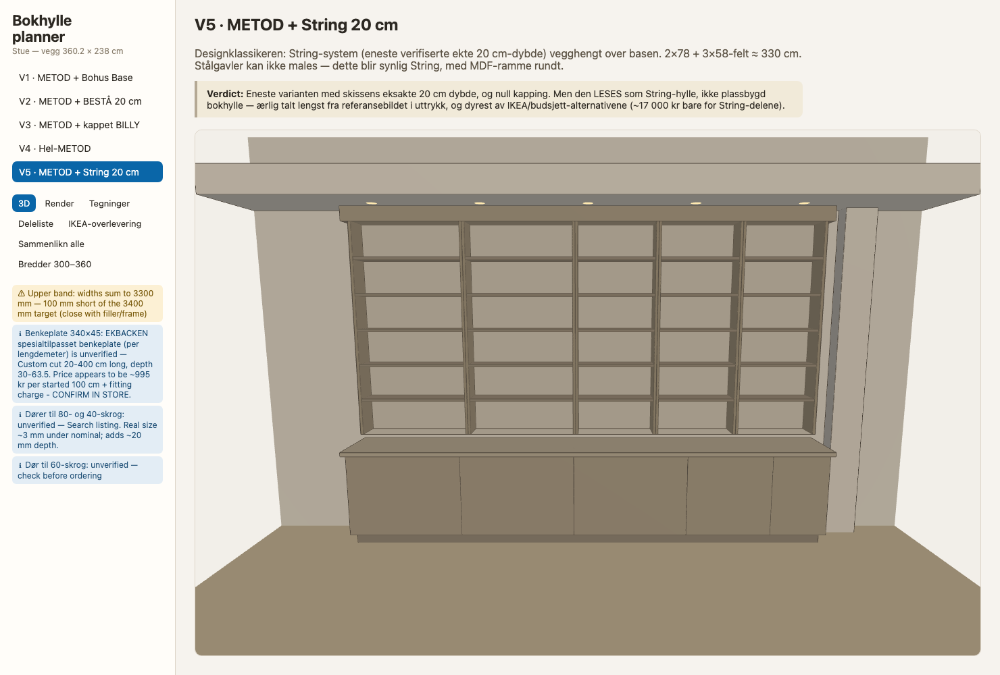
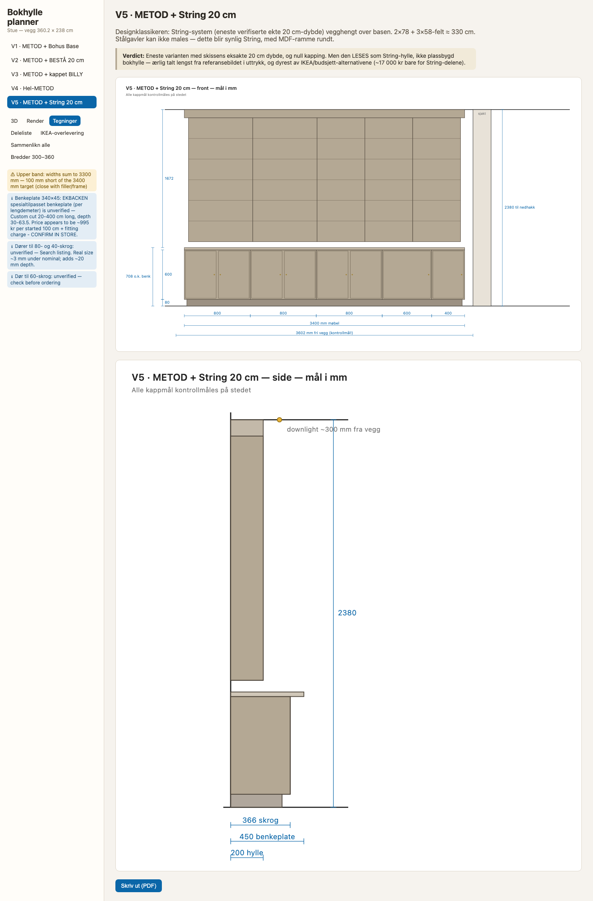

## Anbefaling

**V3 (BILLY)** hvis 28 cm dybde går klar av downlights — billigst, sterkest
hyller, kjent hack for proffe montører. **V2 (BESTÅ)** hvis 20 cm-dybden fra
skissen er viktigst og 12 mm-klaringen bekreftes på stedet. V1 gir finest
resultat av butikk-overdelene, men da bør man først se snekkerprisen på ren
MDF-overdel — differansen er trolig liten.

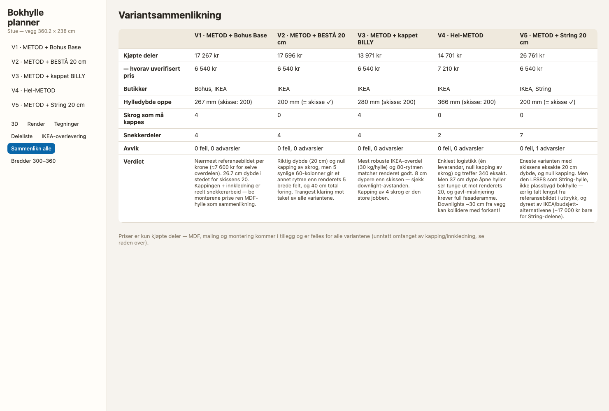

## Andre bredder (300–360 cm)

Appens «Bredder 300–360»-fane regner ut beste modulkombinasjon per bredde
(skjermbilde: `screenshots/bredder.png`). Høydepunkter: **320 og 360 cm treffer
eksakt for både METOD-base og BILLY** (320 = 4×80; 360 = 4×80+40). Bohus-790
passer best rundt 320–340; under 320 blir foringene store.

## Innfesting

Verifisert mot dokumenterte bygg i [fastening.md](fastening.md): sokkelboks +
skinne for basen (veggskap skal ikke stå på ben alene), lommeskruer/klosser ned
i platen, topplekt i stendere per skrog (veltesikring), naboskrog boltes.
BILLY kappes fra TOPPEN så fabrikkbunnen bærer mot platen.
